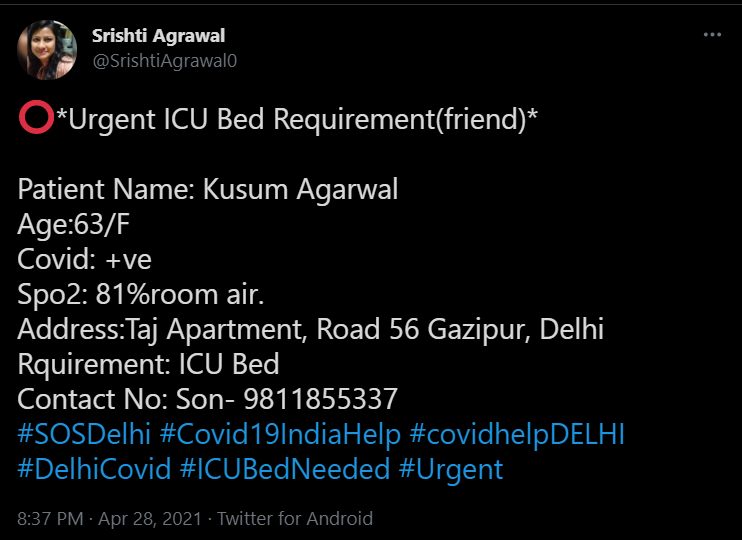

### Project idea :
Covid Health Service (A Bot To help people find resources with in seconds and will reply to their post)
### Problem statement :
During this harsh pandemic, many are facing scarcity of beds, oxygen, vaccines and medicines. Due to which they are losing their loved ones just because they do not know a proper resource for getting the help. There are multiple websites/platforms providing contact info of resource providers in particular states and cities, But the problem is, they are all splitted in multiple platforms (Apps or websites) and a person with an emergency can’t just wait to find the best possible resource immediately. We need a single website or application or any platform providing all information and also helping people at the same time instantly on twitter, linkedin, facebook etc. People should be there to update the contact info or add the contact info. But what can we do about that...So here is our solution for that.
### Solution Statement :
We came up with a solution to build a twitter bot which basically replies with a auto generated information chunk to all people posting tweets on some famous hashtags meant for Covid-19 resources such as #SOS, #URGENT, #COVID, #COVIDHELP etc.

### What info will be replied by bot ?
The bot will auto detect the location, hospital name, phone no, and type of resource needed through the tweet and quickly update the person by replying on the same tweet with the nearest possible location of the resource supplier from the database.
### Where is the data ?
So, we will update the information from all possible resources on our database, Also enabling other users to update the info of resources they know about on our website, this info will be used by the bot to analyse and reply to the person in demand of resources on twitter.
### How did we reduce the efforts and time of patients with this idea ? (Novelty of the project)
- Fast replies with resources: Users don’t have to rely on somebody for resources or waiting somewhere.
- All updated resources at one place.
- Making a bridge between covid patients in need of resources and suppliers on twitter with updated leads.
### Additional features to be added in future:
- Improving the accuracy of data provided by the bot (resource verification).
- Improving text analysis.
- Apart from this, social media platforms like twitter are filled with queries like for job openings, Best online shop for a particular product or for charity or funds.
We can implement these types of automation to instantly help people with leads.
### Tech stack we will use:
Initially we will use javascript, nodeJs, python, twitter api to build the bot.
And for hosting we will use heroku or AWS EC2.
Alternatively to speed up the replies we can also use web scraping (following the twitter automation guidelines).
For making the website we will use MERN stack.
CRUD functionality.

